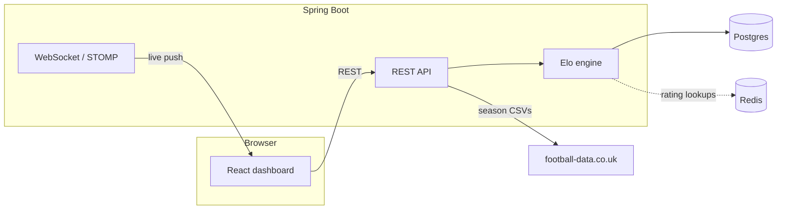
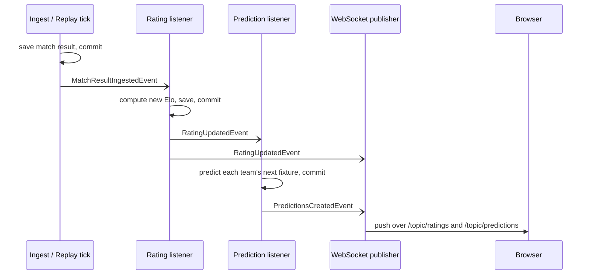

# Elo Live

A simple Elo rating system for football. It pulls real results for the top five
European leagues, i.e. England, Spain, Germany, Italy, France, all divisions, back
to 1993 until 2026/2027 season, computes ratings with a hand-built Elo engine, predicts each team's
next match, and pushes every update to the browser over WebSocket as it
happens. There's also a replay mode that streams an old season through the
exact same live pipeline, one matchday at a time, so you can watch the whole
thing work without waiting for a real match to finish.

**Live:** [elo-live-omega.vercel.app](https://elo-live-omega.vercel.app)

## How it's put together



Postgres is the source of truth for everything: matches, ratings, predictions.
Redis only caches "what was this team's rating on this date" lookups, which
get computed a lot during a replay — nothing lives there that Postgres
couldn't rebuild.

## What happens when a match finishes

It publishes an event, and everything
downstream reacts to it, each piece committing its own database work before
the next one starts:



Every hop only fires **after** the previous transaction actually commits.
That's the whole reason a replay can safely trickle a season out matchday by
matchday and have ratings, predictions, and the live feed stay honestly in
sync with each other — nothing downstream ever reacts to data that could
still get rolled back.

## Running it locally

You'll need Postgres and Redis. Use Docker for convenience:

```bash
docker run -d --name bookie-postgres -p 5432:5432 \
  -e POSTGRES_DB=bookie -e POSTGRES_USER=bookie -e POSTGRES_PASSWORD=bookie_dev_password \
  postgres:17
docker run -d --name bookie-redis -p 6379:6379 redis:7
```

Backend:

```bash
./mvnw spring-boot:run
```

Frontend:

```bash
cd frontend
npm install
npm run dev
```

Ingest a season once both are up (say, the Premier League's 2023/24):

```bash
curl -X POST "http://localhost:8080/api/ingest?league=E0&season=2324"
```

or use the "Ingest data" page in the app itself, which can also pull an
entire division's full history in one go.

## Stack

Java 21, Spring Boot 4, Postgres, Redis, WebSocket/STOMP on the backend.
React 19, Vite, TypeScript, Tailwind, shadcn/ui on the frontend. Deployed on
Railway (API, Postgres, Redis) and Vercel (frontend).
